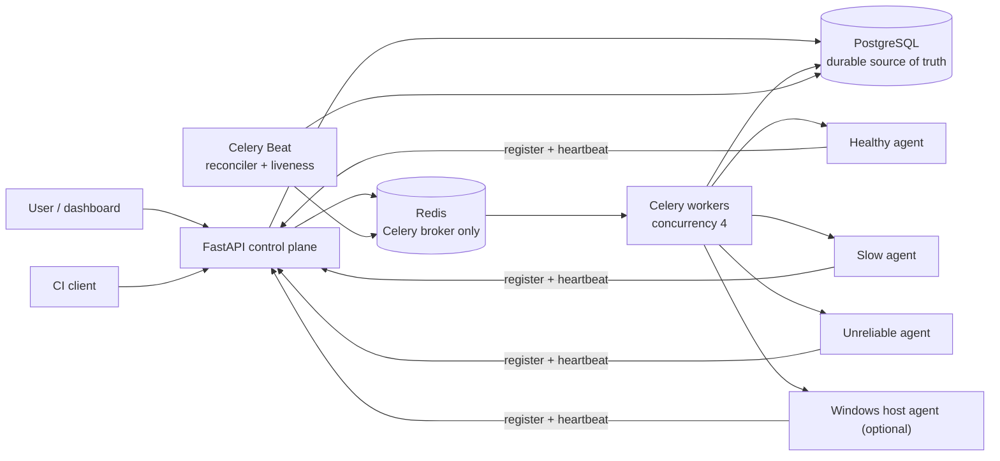

# PulseHunter

**Distributed Device Validation Platform**

[](https://github.com/MdFahimBashar/PulseHunter/actions/workflows/ci.yml)

PulseHunter is a distributed validation control plane for scheduling and
executing tests across networked devices, with heartbeat-based health
monitoring, retries, timeouts, durable job state, and automated failure
recovery. Deterministic Python simulators make the complete workflow runnable
without a physical hardware lab.

## Problem

Firmware and device teams cannot validate every build by manually flashing and
checking a bench full of boards. A useful lab service must know which devices
are alive and available, allocate them without double-booking, perform work
asynchronously, survive temporary failures, and preserve results for engineers.

## Features

- registration, heartbeats, online/offline/busy state, and exclusive reservation
- healthy, slow, and unreliable standalone device agents
- Windows host agent with predefined checks, verified on a physical laptop
- PostgreSQL-backed test suites, runs, jobs, results, logs, errors, and timings
- Redis/Celery task delivery with four concurrent worker slots
- bounded retries with exponential backoff, HTTP timeouts, and worker leases
- a periodic reconciler that recovers durable queued work and expired leases
- run-status aggregation and correct device release after terminal jobs
- REST/OpenAPI endpoints plus a dashboard for compatible device selection and readable results
- API-based CI client that gates a build on the final device-validation result
- Alembic migrations, deterministic seeding, automated tests, and GitHub Actions

## Architecture



PostgreSQL is authoritative. Redis contains task messages, not permanent job
results. A Celery message carries only a job UUID; the worker locks and reads
the current state from PostgreSQL before acting. Device agents are separate
HTTP processes. The optional Windows host agent implements that same boundary
outside Docker. See [docs/architecture.md](docs/architecture.md) for the
detailed state and failure model.

## Quick start

Requirements: Docker Desktop with Linux containers and Docker Compose. From a
fresh clone, enter the repository root and run:

```bash
docker compose up --build --detach --wait
```

Wait until the three agents have registered, then open:

- dashboard: <http://127.0.0.1:8000/>
- Swagger/OpenAPI: <http://127.0.0.1:8000/docs>
- health: <http://127.0.0.1:8000/health>

The stack includes PostgreSQL, Redis, a one-shot migration/seed service, the
API, a Celery worker, Celery Beat, and three device agents. Only the API is
published to the host.

Stop the system without deleting its database:

```bash
docker compose down
```

Use `docker compose down --volumes` only when you intentionally want a clean
local database and Redis volume.

## Demo workflow

The dashboard offers all compatible online devices or an explicit selection
for the chosen suite. Open a created run to inspect per-device attempts, logs,
duration, errors, and final status.

From PowerShell, the all-device API flow is:

```powershell
$suite = Invoke-RestMethod http://127.0.0.1:8000/test-suites |
  Where-Object slug -eq 'smoke' | Select-Object -First 1
$body = @{ test_suite_id = $suite.id } | ConvertTo-Json
$run = Invoke-RestMethod -Method Post -Uri http://127.0.0.1:8000/runs `
  -ContentType 'application/json' -Body $body
$run
Invoke-RestMethod "http://127.0.0.1:8000/runs/$($run.id)/jobs"
```

Or run the automated full-flow verifier after the stack is healthy:

```bash
python scripts/verify_e2e.py --timeout 90
```

The default all-device run is expected to be `failed`: healthy passes on its
first attempt, unreliable returns one transient failure then passes, and slow
exhausts three HTTP timeouts. That intentional mixed result makes retries,
timeouts, persistence, aggregation, and release behavior visible in one run.

## CI integration

After installing the Python package, a CI job can create a run and wait for its
result using the same API and workers as the dashboard:

```bash
pulsehunter-ci run --server "$PULSEHUNTER_URL" --suite smoke \
  --device-id "$PULSEHUNTER_DEVICE_ID" --wait --timeout 120
```

`--suite` takes the slug from `GET /test-suites`; repeat `--device-id` to request
multiple devices, or omit it to reserve every available device. `--wait` makes
the process a build gate: exit `0` means the run passed; `1` means validation
failed or was cancelled; `2` means a client/API/start error; `3` means the
client's wait deadline expired. Without `--wait`, exit `0` means only that the
run was accepted, **not** that validation passed. The default all-device demo
includes a slow agent and intentionally fails, so select a passing device for
a green CI example.

Optional `--repository`, `--commit`, `--ref`, and `--build-id` attach source
context to the run (the commit SHA is required if any source field is used).
`GET /runs/{run_id}` returns this context, making the triggering commit
traceable without changing job execution. See the
[GitHub Actions example](examples/github-actions-device-validation.yml) for a
trusted self-hosted runner on the lab network. PulseHunter has no agent/user
authentication or TLS in this MVP; source context is caller-supplied, not
cryptographically verified. Do not expose its API to an untrusted CI runner or
the public internet.

## Physical Windows host agent

An optional agent runs directly on a trusted-LAN Windows laptop and performs
real, bounded system and integrity checks. It registers as `windows-host` with
`simulated=false`; the three Docker simulators remain available. On the
dashboard, choose `host-health`, select the online physical host, and open the
run to see readable system and integrity results. Registration, LAN execution,
result persistence, dashboard rendering, and offline/reconnect behavior were
manually verified on a physical Windows laptop; the validation passed on its
first attempt. GitHub Actions tests the agent contract and Docker simulators,
not the physical laptop. See [Windows host agent setup](docs/windows-host-agent.md)
for Python, firewall, startup, and verification steps.

## API

| Method | Path | Purpose |
|---|---|---|
| `GET` | `/health` | Check PostgreSQL and Redis connectivity |
| `GET` | `/devices` | List the device fleet |
| `GET` | `/devices/{device_id}` | Read one device |
| `GET` | `/test-suites` | List predefined validation suites |
| `GET` | `/runs` | List recent runs and aggregate counts |
| `POST` | `/runs` | Reserve devices, persist jobs, and queue a run |
| `GET` | `/runs/{run_id}` | Read aggregate run state |
| `GET` | `/runs/{run_id}/jobs` | Read per-device results, logs, errors, and attempts |
| `POST` | `/internal/devices/register` | Register or refresh an agent by name |
| `POST` | `/internal/devices/{device_id}/heartbeat` | Update agent liveness/capabilities |

`POST /runs` accepts a `test_suite_id`, an optional non-empty `device_ids` list,
and optional validated `source` context. Without device IDs it selects every
fresh online device. It returns `409` when the requested devices cannot be
reserved.

## Simulation modes

- **healthy** waits 0.4 seconds and returns a passing result with logs.
- **unreliable** deterministically returns HTTP 503 once per job, then passes;
  this exercises retry and exponential-backoff behavior reproducibly.
- **slow** continues a 20-second execution while each worker HTTP call times
  out after 3 seconds; three bounded attempts end in `timed_out`.

The agent execution endpoint is idempotent by job UUID within one agent
process. An accepted execution continues even if the worker's HTTP request
times out, and a duplicate request attaches to the same in-memory task.

## Testing and local development

Python 3.14 is the supported development runtime.

```bash
python -m venv .venv
.venv\Scripts\Activate.ps1
python -m pip install --upgrade pip
python -m pip install -e ".[dev]"
ruff check .
ruff format --check .
mypy src
pytest -W error
```

The default Compose network intentionally keeps PostgreSQL and Redis off host
ports. GitHub Actions runs the `integration` test against real service
containers. Locally, the supported cross-service verification is:

```bash
docker compose up --build --detach --wait
python scripts/verify_e2e.py --timeout 90
```

The one-shot `migrate` service applies migrations and seeds both predefined suites
during Compose startup. With the Compose database running, verify schema drift
and seed idempotency from the same container network:

```bash
docker compose run --rm migrate alembic check
docker compose run --rm migrate python -m pulsehunter.db.seed
docker compose run --rm migrate python -m pulsehunter.db.seed
```

## Architecture decisions

- **Database first:** job and run state survives broker restarts and is queryable
  without consulting Celery internals.
- **At-least-once, idempotent processing:** duplicate task delivery is accepted;
  row locks, worker leases, ownership checks, and immutable terminal states stop
  duplicates from corrupting durable results.
- **Reconciliation closes the publish gap:** a run is committed before Redis is
  contacted. If publication fails, Beat republishes the still-queued job.
- **One codebase, distinct processes:** API, worker, scheduler, and agents reuse
  one typed Python package but have separate runtime responsibilities.
- **HTTP device boundary:** new agent types can use the same contract without
  coupling device logic to Celery.

## Current limitations

- This is a trusted-local-network MVP: there is no user authentication, agent
  authentication, TLS termination, or authorization.
- Agent-provided endpoint URLs are trusted. Do not expose registration to an
  untrusted network because workers make requests to those URLs.
- Agent idempotency is in memory and is lost when an agent restarts.
- Cancellation, priorities, per-capability scheduling, artifacts, and log
  streaming are not implemented.
- The seeded suites are predefined simulator and Windows-host checks, not a
  custom test DSL. There is no capability-aware scheduling; select the Windows
  host explicitly for `host-health`.
- Celery Beat should have exactly one instance; multiple schedulers can cause
  harmless duplicate publications but add noise.

## Roadmap

These are planned directions, not implemented features:

- authenticated agent enrollment, authorization, and TLS
- endpoint allowlisting or service discovery for device agents
- capability-aware scheduling, priorities, and cancellation
- artifact retention, log streaming, metrics, and tracing
- durable agent-side idempotency and additional physical-device integrations
- Raspberry Pi and microcontroller gateways

## Documentation and security

See [PROJECT_STATUS.md](PROJECT_STATUS.md) for the current implementation
status and [SECURITY.md](SECURITY.md) before using the software outside a
local development machine. PulseHunter is MIT licensed.
