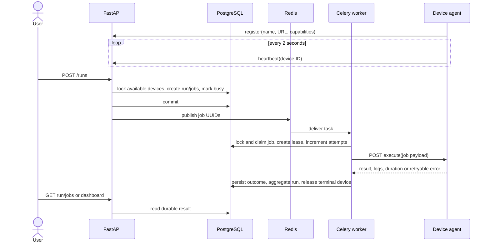
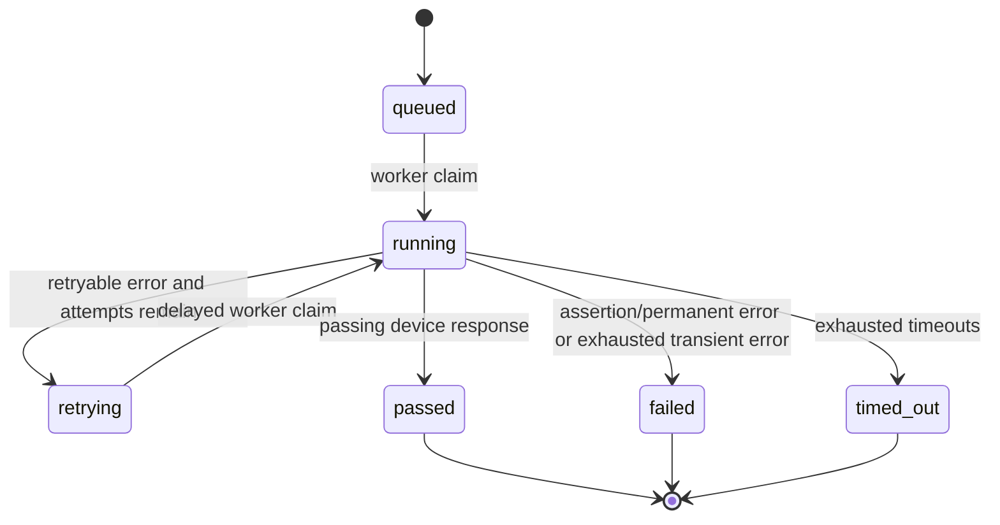

# PulseHunter architecture

## System boundary

PulseHunter coordinates validation work; it does not contain hardware-specific
test code in its control plane. The API owns user-facing requests and durable
resource allocation, workers own asynchronous orchestration, and device agents
own execution. The three Python simulators and the optional Windows host agent
use the same registration, heartbeat, health, and execution HTTP contract.

The `pulsehunter-ci` command is an HTTP client of this same API, not another
scheduler. It resolves a suite slug, creates a run, polls the durable run state,
and turns the terminal result into a process exit code. Optional source
repository/commit/ref/build metadata is validated by the API and stored on the
run in PostgreSQL; Redis remains a task broker only.

## Components and responsibilities

### FastAPI control plane

The API validates input, reports dependency health, registers devices,
processes heartbeats, reserves fresh online devices, persists a run and its
jobs in one transaction, publishes job UUIDs, and serves REST/HTML reads. It
does not execute validations in request handlers. The dashboard uses the
existing run API with explicit device IDs and filters available devices by
their advertised supported suites; this is UI compatibility filtering, not
backend capability-aware scheduling. It refreshes device state from the API
so heartbeat-driven offline and reconnect transitions remain authoritative.

### PostgreSQL

PostgreSQL is the source of truth for devices, suites, runs, and jobs.
Reservation uses row locks with `SKIP LOCKED`, allowing two API requests to
compete without assigning one device twice. Job claims, terminal writes, lease
recovery, and run aggregation also use row locks. Alembic—not application
startup—owns schema evolution.

### Redis and Celery

Redis is only the Celery broker. A message carries a job UUID; it is not a
durable result record. Workers run up to four tasks concurrently and use late
acknowledgement, rejection on worker loss, and prefetch 1. Celery Beat runs two
periodic maintenance tasks:

1. mark devices offline when their heartbeat is stale;
2. republish queued/due jobs and recover expired worker leases.

### Device agents

Each simulator is an independent FastAPI process with its own network address.
It registers by stable name, receives a server UUID, sends heartbeats, and
accepts one execution contract. Healthy, slow, and unreliable behavior comes
from configuration, not different codebases.

The optional Windows host agent is a separate FastAPI process running directly
on the laptop. It advertises a LAN URL, registers as `windows-host` with
`simulated=false`, and accepts only the predefined `host-health` suite. Its
memory and temporary-file integrity tests are fixed-size; it cannot execute
arbitrary server commands. The same database-backed reservation, idempotent
job ID, retry, and heartbeat-offline mechanisms apply. It needs explicit
device selection because capability-aware scheduling is not implemented.
The agent's registration, heartbeat, LAN execution, persisted host-health
result, and offline/reconnect behavior have been manually verified on a
physical Windows laptop. Automated CI covers the agent contract and Docker
simulators, not physical hardware.

## State machines

Run status is derived from its jobs. A run is `queued` before any job starts,
`running` while any job is active, `passed` only when every job passed, and
`failed` when all jobs are terminal and at least one failed or timed out.
Terminal run and job states are sticky.

A device is `online` after registration/a fresh heartbeat, `busy` while it has
an active job, and `offline` after heartbeat expiry. A heartbeat never changes
a reserved device from busy to online. Retries retain the reservation. A
terminal job releases the device to online if its heartbeat is still fresh,
otherwise offline.

## Retries, timeouts, and worker loss

An attempt is counted when a worker successfully claims a job. HTTP timeout,
connection failure, and selected retryable status codes schedule another
attempt using `base * 2^(attempt-1)`, capped by configuration. A deterministic
failed validation and an invalid response are terminal immediately. The final
timeout becomes `timed_out`; another exhausted transient error becomes
`failed`.

Every running job has a database lease longer than the device HTTP timeout. If
a worker is killed before writing an outcome, the reconciler converts an
expired lease into a retry or a terminal failure when the attempt budget is
exhausted. Celery's hard task limit and Redis visibility timeout are configured
longer than the normal device call.
Windows-host calls use a separate 10-second HTTP timeout and corresponding
lease/hard-limit budget; simulator calls retain their 3-second timeout.

## Delivery and idempotency model

PulseHunter provides at-least-once delivery, not exactly-once execution.

- The API commits the run before publishing. This avoids a message referring
  to nonexistent state; the reconciler repairs the opposite failure (committed
  state whose initial publish failed).
- A worker locks the job and ignores terminal jobs, future retries, or jobs
  already owned by a live attempt.
- Completion writes require the same Celery task ID that claimed the attempt,
  so a late response cannot overwrite a later owner or terminal result.
- Agents cache accepted executions by job UUID and reject reuse with a changed
  payload. The cache is process-local in the MVP.

The periodic reconciler may publish duplicates. That is intentional and safe
under the claim rules; it is simpler and more honest than claiming exactly-once
behavior from Redis/Celery.

## Data model

- `devices`: stable identity, endpoint, capabilities, heartbeat, state
- `test_suites`: predefined validation definition and description
- `test_runs`: one requested suite execution, aggregate state, and optional
  caller-supplied source commit context
- `test_jobs`: one run/device assignment with attempts, lease, result, logs,
  errors, and timing

One run has one job per reserved device, enforced by a unique database
constraint. Foreign keys prevent deleting referenced suites/devices and cascade
run deletion to its jobs.

## Security and production gaps

The Compose stack binds only the API to host loopback by default; trusted-LAN
testing can temporarily widen that host binding. Internal registration
and execution have no authentication. Agent URLs are trusted and therefore an
untrusted registrant could cause server-side requests to arbitrary locations.
A production design needs authenticated agent identity, an endpoint allowlist
or service discovery, TLS, authorization, secrets management, rate limits,
audit records, and deliberate network segmentation.

Additional production work would include durable agent idempotency, artifact
storage, cancellation, richer scheduling, tracing/metrics, high-availability
scheduler leadership, database connection tuning, and load/capacity tests.
